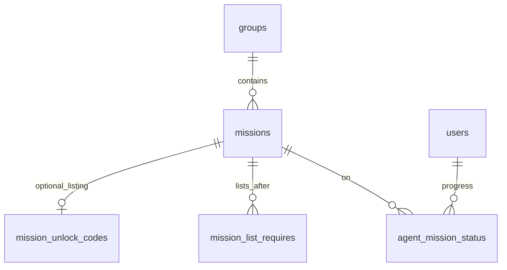

# Data model

SQLite. **Groups** are story arcs (organization for the dashboard and operator views). **Missions** belong to one group. **Constraints** are keyed by `mission_id`. Mission availability is controlled by `access_rule` and constraint tables — not group membership.

## Groups

- `groups` — named story arcs (e.g. **Orientation**, **Testing Storyline**, **Last Transmission**)
- `missions.group_id` — which arc a mission belongs to (UI sections, operator reports)
- Groups do **not** gate access; any signed-in agent is evaluated against each mission’s `access_rule`

## Missions

| Field | Purpose |
|-------|---------|
| `slug` | Stable internal id |
| `title` | Agent-visible name |
| `brief_markdown`, `debrief_markdown` | Mission Brief / Debrief markdown |
| `group_id` | Story arc for dashboard grouping |
| `access_rule` | How the mission gets on the agent’s list |
| `completion_code` | Completion data string (marks mission complete when submitted) |

### `access_rule` (one per mission)

A mission is listed by **submitting listing data** or **automatic listing after completions**, not both: `unlock_code` missions have no `mission_list_requires`.

| Value | Listed when |
|-------|-------------|
| `open` | Any signed-in agent (sync creates `active` row) |
| `unlock_code` | Agent submits matching listing data (`mission_unlock_codes`) |
| `requires_complete` | Agent completed all `mission_list_requires` missions |

## Constraint tables

### `mission_unlock_codes` (one row per mission)

Each `unlock_code` mission has exactly one row in this table (`mission_id` PK). The **`unlock_code` column** stores listing data; the string is not unique across rows — the same value may gate multiple missions. Submitting it lists every matching mission not yet on the agent's dashboard. Listing-gated missions are mutually exclusive with automatic listing (**`mission_list_requires`**) on the same mission.

### `mission_list_requires` (1:many)

Must **complete** `required_mission_id` before this mission is **listed**.  
Used with `requires_complete`. Prereqs may span story arcs if you design them that way; in-arc chains are the common case.

## Users

- **`is_operator`**: SQLite `INTEGER` `0` or `1` (not a native boolean); `1` may use read-only operator progress UI (V1)
- Signed-in agents are provisioned on first OAuth; the operator uses one `users` row (`is_operator = 1`)

## Agent progress

**`agent_mission_status`**: `(user_id, mission_id, status)` — `active` | `completed`.

- Completed missions may display recovered data (`missions.completion_code`); never expose it for `active` missions
- **No row** means not listable yet (listing data not submitted, or list prereqs not met). Missions that are not listable are **hidden** from the agent dashboard — not shown as locked placeholders
- For listable `open` missions, a missing row is a **sync error**

## Operator progress (V1, read-only)

Organize by story arc (`groups` → `missions`). For each mission, show agents who have **any** `agent_mission_status` row on missions in that arc, or all signed-in users for globally `open` missions (TBD in UI implementation).

| Label | Rule |
|-------|------|
| complete | status row `completed` |
| active | status row `active` |
| not started | signed-in user, no status row on this mission |

## Runtime (summary)

Keep **`agent_mission_status` current immediately** on login, listing submit, and complete — agent dashboard and operator views read this table.

1. Signed-in agent  
2. **List:** per `access_rule` + `mission_list_requires` → ensure `active` row exists when listable  
3. **Complete:** mission is `active` and submitted data matches `completion_code` → `completed`  
4. On complete → sync: create `active` rows for missions whose `mission_list_requires` are now satisfied  

## Diagram

## SQL reference

[03-database-schema.md](03-database-schema.md) · [04-example-data-walkthrough.md](04-example-data-walkthrough.md)
