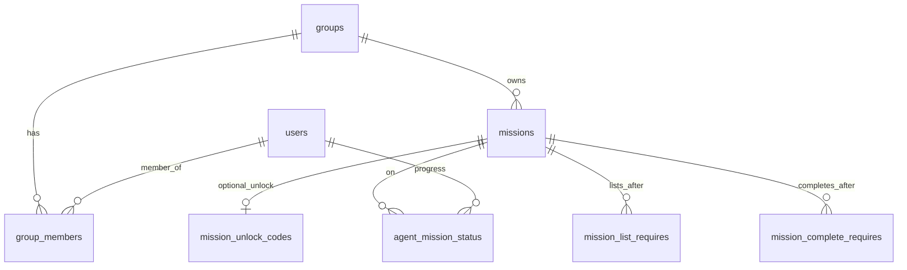

# Data model

SQLite. **Groups** are rosters. **Missions** belong to one group. **Constraints** are keyed by `mission_id`.

## Groups

- `groups` + `group_members`
- Every signed-in `@moravian.edu` agent is in the campus-wide group (seed: **Orientation**; auto on first OAuth)
- Class missions use `missions.group_id` = class group; agents need an explicit `group_members` row
- SQL roster changes: always add **Orientation** + class group; sync runs immediately (see [07-operator-setup.md](07-operator-setup.md))

## Missions

| Field | Purpose |
|-------|---------|
| `slug` | Stable internal id |
| `title` | Agent-visible name |
| `brief_path`, `debrief_path` | Mission Brief / Debrief markdown |
| `group_id` | Which group owns this mission |
| `access_rule` | How the mission gets on the agent’s list |
| `completion_code` | Secret to mark completed |

### `access_rule` (one per mission)

A mission is surfaced by **unlock code** or **automatic listing after completions**, not both: `unlock_code` missions have no `mission_list_requires`.

| Value | Listed when |
|-------|-------------|
| `open` | Agent is in the group (`active` status row when synced) |
| `unlock_code` | Agent redeems `mission_unlock_codes` |
| `requires_complete` | Agent completed all `mission_list_requires` missions (automatic unlock after other missions) |

## Constraint tables

### `mission_unlock_codes` (1:1)

`unlock_code` text when `access_rule = unlock_code`. V1 excludes **submission** prerequisites on redeemable missions (`mission_complete_requires` with this mission as `mission_id`): a code-unlocked mission is not also gated by “complete other missions first.” Codes are mutually exclusive with automatic listing (**`mission_list_requires`**).

### `mission_list_requires` (1:many)

Must **complete** `required_mission_id` before this mission is **listed**.  
Used with `requires_complete`. Required missions should share the same `group_id`.

### `mission_complete_requires` (1:many)

Must **complete** required missions before **submitting** `completion_code`.  
Stealth enforcement: generic “not yet” in UI; inputs stay enabled.

Multiple rows = **all** required (AND).

Omit when **`mission_list_requires`** already requires the same missions to be `completed` before the mission is visible (sample: **identify-the-traitor**).

## Users

- **`is_operator`**: SQLite `INTEGER` `0` or `1` (not a native boolean); `1` may use read-only operator progress UI (V1)
- Signed-in agents are provisioned on first OAuth; the operator uses one `users` row (`is_operator = 1`)

## Agent progress

**`agent_mission_status`**: `(user_id, mission_id, status)` — `active` | `completed`.

- Completed missions may display `missions.completion_code`; never expose it for `active` missions
- Agent must be in the mission’s group
- **No row** means not listable yet (`unlock_code` not redeemed, or list prereqs not met). Operator UI labels this **locked**. For listable `open` missions, a missing row is a **sync error**.

## Operator progress (V1, read-only)

For each mission, show each agent in that mission’s **group roster** with:

| Label | Rule |
|-------|------|
| complete | status row `completed` |
| active | status row `active` |
| locked | roster member, no status row |

## Runtime (summary)

Keep **`agent_mission_status` current immediately** when roster membership changes, on login, and after unlock/complete — agent dashboard and operator grids read this table.

1. Agent in group → eligible for that group’s missions  
2. **List:** per `access_rule` + list requires → ensure `active` row exists when listable  
3. **Complete:** complete requires → match `completion_code` → `completed`  
4. On complete → sync: create `active` rows for missions whose `mission_list_requires` are now satisfied  

## Diagram

## SQL reference

[03-database-schema.md](03-database-schema.md) · [04-example-data-walkthrough.md](04-example-data-walkthrough.md)
